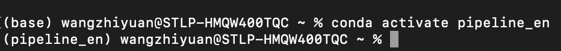
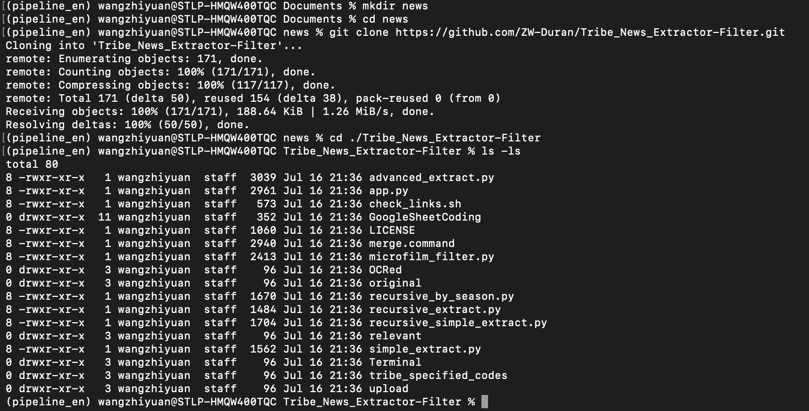
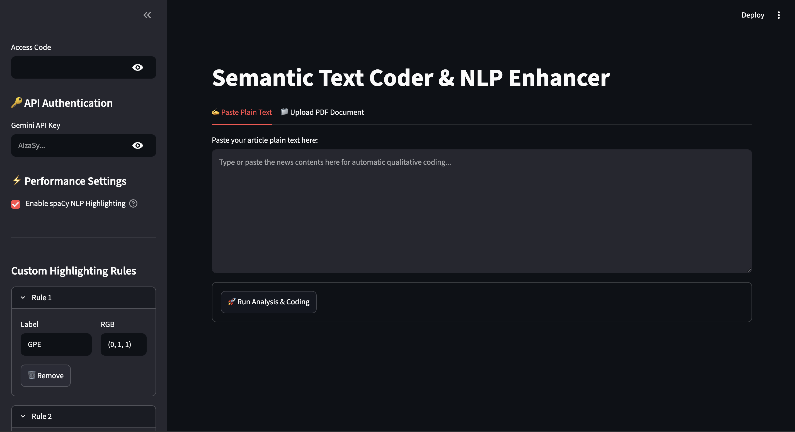
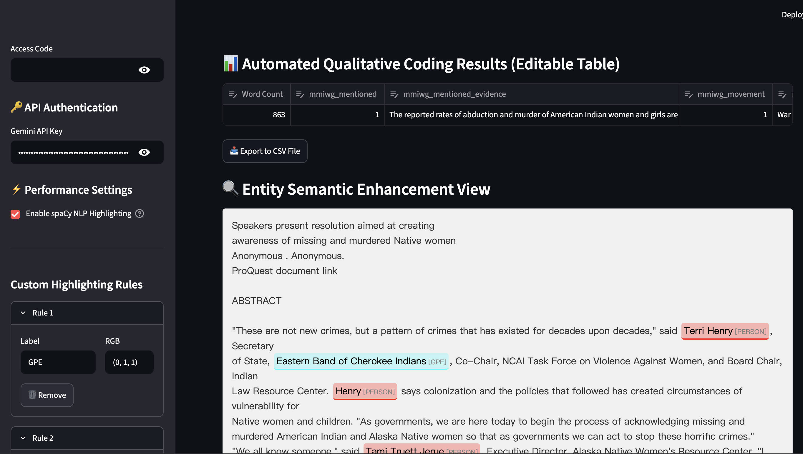

# **Automated Archival Text Analysis Pipeline**
https://github.com/ZW-Duran/Tribe_News_Extractor-Filter
July 16th, 2026
## Introduction

In this documentation project, I developed an instructional manual for an open-source technical pipeline I created. The software automates the traditionally manual process of qualitative text coding and semantic highlighting for academic literature and newspaper archives. By taking a complex, multi-layered Python architecture (involving spaCy NLP models and Google's Gemini LLM) and wrapping it in a Streamlit Graphical User Interface (GUI), the tool aims to revolutionize how researchers analyze text. Creating the manual for this software required careful consideration of my audience, content structure, visual design, and my own technical communication skills.

### Audience Analysis and Rhetorical Adaptation
My primary audience consists of academic researchers, graduate students, and policy analysts in the social sciences. As detailed in my Audience and Use Profile, these users possess high cognitive capacity and deep methodological knowledge but often experience "tech anxiety" when confronted with command-line interfaces (CLI) or programming jargon. They are motivated by efficiency but easily alienated by assumptions of prior computer science knowledge.

Understanding this audience fundamentally changed my design and content strategies. For instance, my underlying software actually contains heavy backend scripts (like bash-based OCR parallel processing and multi-threaded Ollama local executions). However, I made the rhetorical choice to exclude these CLI-heavy components from this specific manual. Instead, I focused entirely on the Streamlit Web GUI (app.py). By guiding them through a browser-based interface, I met the audience "where they are." To decrease anxiety, I maintained an encouraging, pedagogical tone. For example, instead of using developer shorthand like "Spin up the local environment," I wrote, "Open your terminal and type the following command to start the application."

### Content Selection and Research
The research for this documentation stemmed directly from my hands-on development and testing of the software. I had to reverse-engineer my own intuitive workflows into discrete, digestible actions. I chose to divide the manual into three core tasks: 
1) Setting up the application environment;
2) Configuring API keys and custom highlighting rules;
3) Executing the analysis and exporting data;

I included persuasive content in the Preface to build trust (Ethos) with the academic audience. For example, I explicitly mention how the tool utilizes a "Two-Step Verification Filter" based on linguistic rules. I included this because social scientists heavily scrutinize data integrity; they need to know the automation is methodologically sound before they will trust it. Furthermore, I deliberately included troubleshooting steps for common API errors, as my hands-on testing revealed that incorrect API key entry is the most frequent user roadblock.

### Appearance and Formatting Choices
The visual formatting of this document strictly adheres to procedural conventions. I utilized negative (white) space heavily to ensure the pages do not appear cluttered, which helps mitigate user overwhelm. Every single actionable step begins with an imperative verb (e.g., "Click," "Type," "Navigate").

I chose to use numbered lists for sequential processes and bulleted lists for non-sequential warnings or supply requirements. To bridge the gap between text and action, I accompanied every single step with a cropped screenshot. In these visuals, I added red bounding boxes and arrows to direct the user's eye exactly to the relevant button or text field. As an example of my formatting choices, I utilized distinct block formatting for Danger and Warning notices (e.g., "DANGER: Never share your API Key") to ensure critical security information stands out visually from the procedural text.

### Experience and Reflection
The most difficult part of this project was combating the "curse of knowledge." Because I wrote the code, actions that felt like a single step to me (e.g., "Install dependencies") actually required five or six distinct physical actions from a novice user. Breaking these down forced me to be hyper-aware of user interactions.

I thoroughly enjoyed designing the visual layout and seeing the document transform from a wall of text into a professional, intuitive guide. The process of pairing screenshots with concise, action-oriented text was highly satisfying. If I were to do this project differently in the future, I would conduct a live usability test with a non-technical peer earlier in the drafting process to identify "blind spots" where I inadvertently skipped a micro-step. Overall, this project significantly strengthened my ability to translate complex technical architectures into accessible, user-centric documentation.  

<div style="page-break-after: always;"></div>

## Preface
Welcome to the Automated Archival Text Analysis Pipeline User Manual.

In disciplines like sociology, history, and public policy, qualitative researchers often face the monumental task of manually reviewing, highlighting, and coding thousands of pages of newspaper archives and institutional documents. This traditional process is not only time-consuming but also prone to human fatigue and coding inconsistencies.

This manual provides a comprehensive, step-by-step guide to deploying a semi-automated, open-source pipeline designed specifically for non-technical academic researchers. By integrating Optical Character Recognition (OCR), Natural Language Processing (NLP), and Large Language Models (LLMs), this tool transforms raw, unstructured PDF archives into clean, rigorously coded, and visualization-ready datasets.

You do not need a computer science background to use this manual. Whether you are running the lightweight web interface for a single document or executing the batch-processing engine for an entire archival directory, these instructions will guide you through configuring your environment, safely executing the scripts, and exporting your final analytical matrix.

## <mark>General Warning, Caution, and Danger Notices</mark>
To ensure a smooth and safe execution of the data pipeline, please observe the following notices throughout the manual. They are categorized by severity to protect your data, system integrity, and research timeline.
### Danger
* Irreversible Data Overwrite: The batch-processing scripts write directly to a centralized .csv file. Always maintain a secure, secondary backup of your master dataset before executing the coding scripts. Interrupting the script mid-write may result in corrupted data.

* API Exposure: Never hardcode, commit, or publicly share your Google Gemini API key or Google Drive access credentials. Exposing these keys can result in severe financial charges or unauthorized access to private research data.
### Warning
* Dependency Failures: The batch OCR engine relies heavily on system-level binary tools. You must ensure gs (Ghostscript) and ocrmypdf are properly installed on your machine. Attempting to run the pipeline without these foundational tools will cause the program to crash immediately.

* Cost and Rate Limits: Processing large batches of text through cloud-based LLMs (like the Gemini API) consumes tokens. Monitor your API usage dashboard to avoid unexpected billing or hitting rate limits that will freeze your pipeline.
### Caution
* Absolute File Paths: The pipeline scripts utilize absolute directory paths to locate PDFs and CSVs. Moving your project folder or renaming directories after configuration will break the file linkages. Always double-check your path variables if the system reports a "File Not Found" error.
* Remember to activate the correct conda environment before you run your program
* Model Hallucinations: While the pipeline utilizes strict prompt constraints and two-step verification filters, automated coding is not infallible. Always cross-reference the extracted "evidence" strings in your output file to verify contextual accuracy.

<div style="page-break-after: always;"></div>

# Table of Content:
[TOC]

<div style="page-break-after: always;"></div>

## <mark>Equipment and Supplies</mark>:
Before initiating the setup process, verify that you have the following hardware, software, and access credentials ready.
### Hardware Prerequisites
* A personal computer running macOS (recommended) or Linux. (Note: Windows users must utilize the Windows Subsystem for Linux [WSL] to execute the Bash shell scripts).
At least 8GB of RAM (16GB recommended for running local Transformer NLP models and parallel threading).

* Sufficient local storage space for high-resolution, processed OCR PDFs.
* Computer is able to connect to the internet (The setup process may download lots of contents, make sure you have stable internet connection)

### Software and System Tools
* A Plain Text Code Editor: Such as Visual Studio Code (VS Code), Sublime Text, or Atom, for modifying configuration files.
* Terminal / Command Prompt: The default command-line interface on your operating system.

### Accounts and Credentials

* A valid Google Gemini API Key (required for the cloud-based qualitative coding engine).

* Access to the target Google Drive directory containing the raw PDF archives.

### Required Python Libraries (Dependencies) 
(Detailed installation instructions for these will be provided in Task 1)
```
spacy (and the en_core_web_trf / or en_core_web_sm for small RAM / en_core_web_lg for CPU user)
streamlit
PyMuPDF (fitz)
google-generativeai
pandas
requests
```
<div style="page-break-after: always;"></div>

## <mark>Body of the Manual</mark>
### Task 1: Environment Setup and Dependency Installation
Setting up a clean digital workspace is the critical first step before running any data extraction or coding scripts. This phase ensures that the software has all the necessary tools, libraries, and language models to process your archival PDFs successfully.

#### 1.1 Installing the Conda Environment Manager (Miniconda)
Before creating a virtual environment, you must install a package manager. We highly recommend Miniconda, a lightweight version of Conda that includes only the essential tools without unnecessary bloatware.
(**Note**: These instructions assume you are using **macOS** or **Linux**. Windows users must open their Windows Subsystem for Linux **WSL** terminal to execute the Linux instructions).
##### A. Determine Your Processor Architecture
Before running the installation commands, you must identify whether your system uses an Intel/AMD (x86_64) processor or an Apple Silicon (ARM64/M-Series) processor.
**For macOS users:**
1. Click the Apple icon in the top-left corner of your screen.
2. Select About This Mac.
3. Look at the "Processor" or "Chip" line to see if it lists "Intel" (x86_64) or "Apple M1/M2/M3" (ARM64).

**For Linux / WSL users:**
1. Open your Terminal.
2. Type uname -m and press the Enter key.
3. Observe the output: x86_64 indicates an Intel/AMD system, while aarch64 or arm64 indicates an ARM system.

##### B. Installation Steps
1. Open your Terminal application.
2. Type the following command to create a directory for Conda: 
   ```bash 
   mkdir -p ~/miniconda3
   ```
3. Press the Enter key.
4. Type the following command to download the quiet installation script:
   ***Linux X86_64***
   ```bash
   wget https://repo.anaconda.com/miniconda/Miniconda3-latest-Linux-x86_64.sh -O ~/miniconda3/miniconda.sh
   ```
   ***MacOS X86_64***
   ```bash
   curl -L https://repo.anaconda.com/miniconda/Miniconda3-latest-MacOSX-x86_64.sh -o ~/miniconda3/miniconda.sh
   ```
   ***MacOS ARM64***
   ```bash
   curl -L https://repo.anaconda.com/miniconda/Miniconda3-latest-MacOSX-arm64.sh -o ~/miniconda3/miniconda.sh
   ```
5. Press the Enter key.
6. Type the following command to run the silent installer (which bypasses license prompts and installs Miniconda to your home directory):
   ```bash
   bash ~/miniconda3/miniconda.sh -b -u -p ~/miniconda3
   ```
7. Press the Enter key.
8. Type the following command to clean up your workspace by deleting the downloaded script:
   ```bash
   rm ~/miniconda3/miniconda.sh
   ```
9. Press the Enter key.
10. Type the following command to initialize Conda for your terminal shell:
    **Linux**
    ```bash
    ~/miniconda3/bin/conda init bash
    ```
    **MacOS**
    ```bash
    ~/miniconda3/bin/conda init zsh
    ```
11. Press the Enter key.
12. Close and re-open your Terminal application to complete the installation.

After Operations above, you'll get 
```bash
(base) user@your_computer_name ~ %
```
instead of 
```bash
user@your_computer_name ~ %
```

#### 1.2 Creating a Virtual Environment and Installing Dependencies
Once Conda is installed and active on your system, you must build an isolated virtual environment and install the precise Python libraries required by the analytical pipeline. This step ensures your computer runs the specific versions of the software needed for text processing and large language model integration without interfering with other system applications.
1. Open a new Terminal window:
2. Type the following command to create a clean, dedicated environment named pipeline_env running Python version 3.12:
   ```bash
   conda create -n pipeline_env python=3.12 -y
   ```
3. Press the Enter key.
4. Type the following command to activate your newly created environment:
   ```bash
   conda activate pipeline_env
   ```
5. Press the Enter key. *The command-line prompt updating its prefix from (base) to (pipeline_env) to indicate active status*
   
6. Type the following command to install the core software dependencies required to run both the interactive web GUI and the batch-processing scripts:
   ```bash
   pip install spacy streamlit PyMuPDF pandas requests google-generativeai tqdm
   ```
7. Press the Enter key. Wait until the library installation finishes and the cursor blinks on a new line.
8. Type the following command to download the high-accuracy Natural Language Processing (NLP) transformer model required for text highlighting and entity extraction:
   *For large RAM / Highest Accuracy*
   ```bash
   python -m spacy download en_core_web_trf
   ```
   *For Large RAM & High Speed*
   ```bash
   python -m spacy download en_core_web_lg
   ```
   *For small RAM*
   ```bash
   python -m spacy download en_core_web_sm
   ```

9.  Press the Enter key.
   >CAUTION: The en_core_web_trf model is a heavy transformer file (typically around 400MB). Do not close your terminal or disconnect your internet during this process. A successful download is indicated by a "Pip install of 'en_core_web_trf' was successful" message.

<div style="page-break-after: always;"></div>

### Task 2: Project Retrieval and Directory Navigation
With your virtual environment initialized, you must now establish a project directory on your local machine, install the Git version control system, and clone the software repository containing the extraction scripts.

#### 2.1 Installing the Git Version Control System
Before downloading the program files, you must ensure that your system has Git installed. Follow the instructions below based on your operating system.
##### A. Installation on macOS
1. Open your Terminal.
2. Type the following command to check if Git is already installed: ```git --version``` then Press Enter [If a location returned, skip all the following steps before 2.2]
3. Click Install on the pop-up window that appears if your Mac prompts you to install Xcode Command Line Tools.
4. Type the installation command below if no pop-up appears and the terminal reports "command not found": 
   ```bash 
   curl -L "https://sourceforge.net/projects/git-osx-installer/files/git-2.33.0-intel-universal-mavericks.dmg/download" -o git-installer.dmg
   ```
5. Press the Enter key.
6. Execute these commands in sequence, pressing Enter after each command. Wait until ```user@your_computer_name ~ %``` reappears before entering the next command.
   ```bash
   hdiutil attach git-installer.dmg
   sudo installer -pkg /Volumes/Git\ 2.33.0\ Mavericks\ Intel\ Universal/git-2.33.0-intel-universal-mavericks.pkg -target /
   hdiutil detach /Volumes/Git\ 2.33.0\ Mavericks\ Intel\ Universal/
   ```
   >Caution: This step will ask you to enter your Mac login password. This is normal and secure.
##### B. Installation on Linux / Windows WSL
1. Open your terminal
2. Type the following update command to refresh your system's package list: ```sudo apt update```
3. Press the Enter key 
   >Caution: This step will ask you to enter your Mac login password. This is normal and secure.
4. Type the following installation command: ```sudo apt install git -y ```
5. Press the Enter key.

#### 2.2 Navigating to Your Workspace Directory
You must now choose or create a physical folder on your computer where the program files will live, and navigate into it using your command-line interface.
##### A. MacOS and Native Linux Users:
1. Determine where you want to store your project (for example, your ```Documents``` folder).
2. Open your Terminal.
3. Type the following command to navigate to your Documents directory: ``` cd ~/Documents ```
4. Press the Enter key
5. Type the following command to create a brand new project folder named e.g.```research```:
   ```bash
   mkdir ~/Documents/research
   ```
6. Press the Enter key.
7. Type the Following Command to enter your new folder: ```cd ~/Documents/research```
8. Press the Enter key.
9. Type the following command to enter your new folder: ```cd TribeNews```
10. Press the Enter key

##### B. Windows (WSL) Users:
Because Windows and WSL utilize different file systems, the most foolproof method to open your workspace is via the Windows GUI and PowerShell.
1. Open your Windows File Explorer.
2. Navigate to the physical folder where you wish to run the project.
3. Right-click on any empty space inside that folder.
4. Select ```Open in Terminal``` or ```Open PowerShell window here```
5. Type the following command in the newly opened PowerShell window to launch your WSL Linux subsystem inside that exact folder directory: ```wsl```
6. Press the Enter key.
>***CRITICAL SAFETY CHECK***: When launching WSL from a new PowerShell window, your system will automatically drop you back into your default base environment. You **MUST** reactivate your Conda project environment before proceeding. To do that, type ```conda activate pipeline_env``` and then press the Enter key. **Verify** that ```(pipeline_env)``` is visible at the far left of your terminal prompt.

#### 2.3 Cloning the Project Repository
Now that your terminal is pointed at the correct folder and your environment is active, you can pull the official code repository directly from GitHub.
1. Verify that your terminal path is inside your designated project folder.
2. Type the following command to clone the code repository using the HTTPS link:
   ```bash
   git clone https://github.com/ZW-Duran/Tribe_News_Extractor-Filter.git
   ```
3. Press the Enter key.
4. Type the following command to step into the cloned repository folder: ```cd ./Tribe_News_Extractor-Filter```
5. Type ```ls -ls``` and press the Enter key to display the files.
6. Confirm that you see files such as app.py, coding.py, and download.py printed in your console.
   
 
<div style="page-break-after: always;"></div>

### Task 3: Running the Interactive Web App (Streamlit)
#### 3.1 Launching the Local Web Server
1. Open Terminal and make sure you are in your working directory
2. Run ```streamlit run app.py``` It will automatically open your default browser and open the web tab for you.
3. 
#### 3.2 Configuring the Sidebar (API Keys & Highlighting Rules)
1. The default Access Code is [empty], you could change it in app.py
2. API Key is the one you have from https://aistudio.google.com/api-keys
   >Danger: API Exposure: Never hardcode, commit, or publicly share your Google Gemini API key or Google Drive access credentials. Exposing these keys can result in severe financial charges or unauthorized access to private research data.
3. ```Enable spaCy NLP Highlighting``` is optional (Use to highlight the keywords we specified below, for example, GPE - Locations, Person - People's name). If we only use it to coding, we could untag it to save memory and make the process faster.
4. RGB is the color you want the program use to highlight your Labels.
5. For Label Scheme, see https://huggingface.co/spacy/en_core_web_trf under ```Label Scheme```
#### 3.3 Running Analysis and Exporting CSVs
Once you finished config all your settings, press ``` Run Analysis & Coding```

Now you could see the results. We could ```export to CSV File``` or direclty copy the cells and paste in your sheets.
---
<div style="page-break-after: always;"></div>

***Comming Soon...***

### Task 4: Executing the High-Volume Command-Line (CLI) Pipeline [For Advanced Users only]
#### 4.1 Batch Link Scraping & File Downloading (download.py)
#### 4.2 Local Parallel OCR Processing (ocr.command)
#### 4.3 Multithreaded Local LLM Auto-Coding (coding.py)
#### 4.4 Multi-processed Entity Semantic Highlighting (highlight.py)


### Task 5: Troubleshooting and Error Handling
#### 5.1 Resolving Terminal Dependency Crashes
#### 5.2 Deciphering LLM JSON Parsing Failures